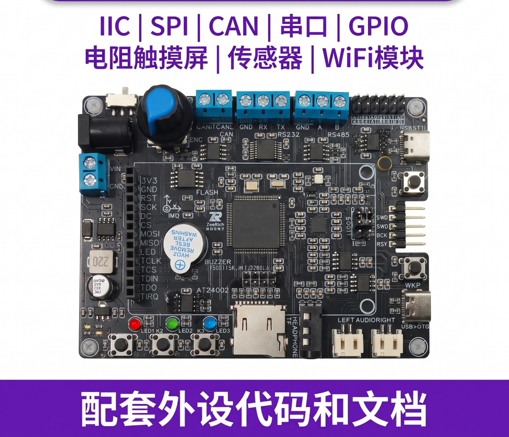

# MQTT OTA 智能终端

> 一块板子，带你完整跑通「端侧设备 → 云端通信 → 固件升级 → 人机交互」全链路。

## 一、项目简介

本项目基于 **MQTT 协议**，从云平台远程获取固件实现 **OTA 在线升级**；采用 **AB 双分区策略**，可一键回退到上一版本，升级失败也不怕变砖；**EEPROM 自动记录当前版本与上一版本号**，为每次升级留好「后悔药」。同时移植 **LVGL 图形库**，打造流畅友好的人机交互界面。

**项目亮点**
- 真实落地的 OTA 工程实践（源自医疗产品实习项目），不是玩具 Demo
- MQTT 端-云通信 + AB 双分区 + 版本回退，一套完整的量产级升级思路
- 软件分层解耦、代码结构清晰，适合当嵌入式软件架构的入门范本
- RTOS + LVGL + 十余种外设集成，一板多用、长期可玩

## 二、这套板子适合谁？

**适合**
- 已有 C 语言 / 单片机基础，想往 **RTOS + 物联网 + 图形界面**方向进阶
- 正在准备**找实习 / 找工作**，想有一个能讲给面试官的拿得出手的项目
- 想要一套**可持续开源跟学**的开发平台，而不是做完一个项目就吃灰

**不太适合**
- 完全没碰过单片机、还没点亮第一颗 LED 的纯新手（建议先入门再上车）

## 三、学完你将掌握什么

每一步都对应板子上真实可跑的功能，建议按阶段推进：
1. **外设驱动**：按键 / LED / 蜂鸣器 / 旋转编码器 / ST7789 屏等，把常用外设玩熟
2. **RTOS 多任务**：理解任务调度、队列、信号量，写出不乱套的多任务程序
3. **MQTT 通信**：设备如何接入云平台、收发消息，打通「端」与「云」
4. **OTA 升级与回退**：固件下发、校验、AB 分区切换、失败回退，跑通完整升级闭环
5. **LVGL 人机界面**：用图形库搭出可交互界面，把后台能力变成看得见的产品

## 四、开发板介绍

**硬件参数**
| 项目 | 参数 |
|---|---|
| 主控 | STM32F407VET6（Cortex-M4F，168MHz） |
| 片内资源 | 512KB Flash + 192KB SRAM |
| 外部存储 | W25Q64 SPI Flash（OTA 分区存储） |
| 屏幕 | ST7789 彩色 LCD + LVGL 图形库 |
| 系统 | RTOS 实时操作系统 |
| 联网 | WiFi / 蓝牙模块 |

**板载外设一览**
1. 按键、LED、蜂鸣器、继电器
2. SD 卡
3. AT24C02（EEPROM，记录版本号）
4. W25Q64（SPI Flash，OTA 分区存储）
5. ST7789 LCD 显示屏
6. 旋转编码器
7. 耳机、麦克风、扬声器
8. AHT20 温湿度传感器
9. WiFi / 蓝牙模块
10. LVGL 图形库
11. MPU6050（六轴姿态传感器）
12. RTOS 实时操作系统

无论入门还是进阶，这块板子的资源都足够你长期学习、反复折腾。

**板子实物图**

## 五、项目背景

这是我第一段实习期间，在一款 **医疗电子产品**上落地的一套 OTA 方案。目前绝大多数消费电子产品都离不开 OTA，掌握这套能力，对找实习、找工作都是实打实的加分项。而项目里用到的**分层设计与模块解耦**，正是很多公司考察嵌入式工程师软件功底的地方——提前吃透，面试时就能多讲出几层东西。

## 六、购买后福利

1. **免费简历指导与润色**：基于我第一段实习的真实工作内容，帮你提炼亮点、把经历讲实讲亮——只做真实经历的呈现，绝不夸大、不造假
2. **面试八股分享**：整理了我面试时面试官围绕 OTA 深挖的高频问题，提前吃透，面试不慌
3. **找实习/找工作加成**：一份对口实习经历，是找下一份实习或工作的最佳跳板；对在职求职者，也多一份差异化竞争力

## 七、交付与售后

**你将拿到**
- 所有外设驱动代码 + 完整工程源码
- 原理图、PCB、使用手册
- 配套教程文档，群内答疑随时交流

**售后承诺**
- 资料永久有效，项目持续开源更新
- 群内答疑，遇到问题随时讨论

## 八、后续规划

这块板子后续会持续更新更多项目，且**依旧全部开源**。它不是一个「一个板子配一个项目」的一次性商品，而是一个能陪你长期学习、持续进阶的成长平台。

**下期预告**：基于同一块板子，继续开源一个 **智能音箱** 项目，敬请期待。

## 九、价格与购买

**价格：¥299**

购买 / 咨询：扫码进群，或私信获取下单方式

**粉丝交流群**：群里可自由讨论**找实习、做项目、找工作、投简历**，也欢迎分享学习心得、互相答疑。
